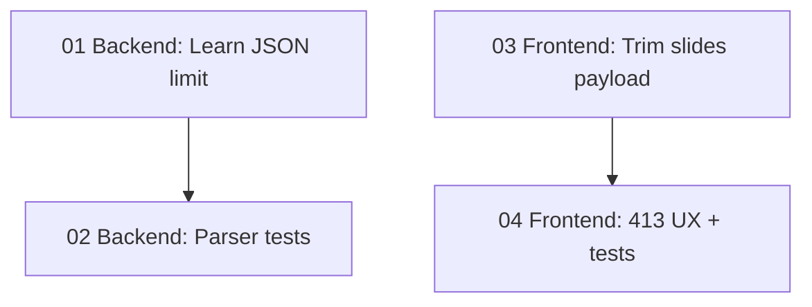

# Implementation Plan: Fix Learn Mode 413 Payload Too Large
**Created:** 2026-02-05  
**Status:** Completed  
**Total Features:** 4  
**Completed:** 4/4

## Progress Summary

| ID | Feature | Status | Dependencies | Priority |
|----|---------|--------|--------------|----------|
| 01 | Backend: Learn JSON body limit (2mb) | ✅ Completed | - | High |
| 02 | Backend: JSON parser middleware tests | ✅ Completed | 01 | Medium |
| 03 | Frontend: Trim learn slides payload | ✅ Completed | - | High |
| 04 | Frontend: 413 UX messaging + unit tests | ✅ Completed | 03 | Medium |

## Dependency Graph

## Status Legend

- ⬜ **Not Started** - Feature not yet begun
- 🔄 **In Progress** - Actively being worked on
- ✅ **Completed** - Feature finished and verified
- ⏸️ **Blocked** - Waiting on dependencies
- ⚠️ **Issues** - Requires attention

## Notes / Decisions

- Backend accepts `/api/learn/*` request bodies up to **2mb** (keeps other `/api/*` at **10kb**, except existing large routes).
- Frontend sends a **trimmed slides payload** for all Learn modes:
  - `subtitle` + `script` only
  - max **12 slides**
  - max **2000 chars** per field (subtitle/script)
- Frontend shows a targeted error message when the backend returns **413**.
