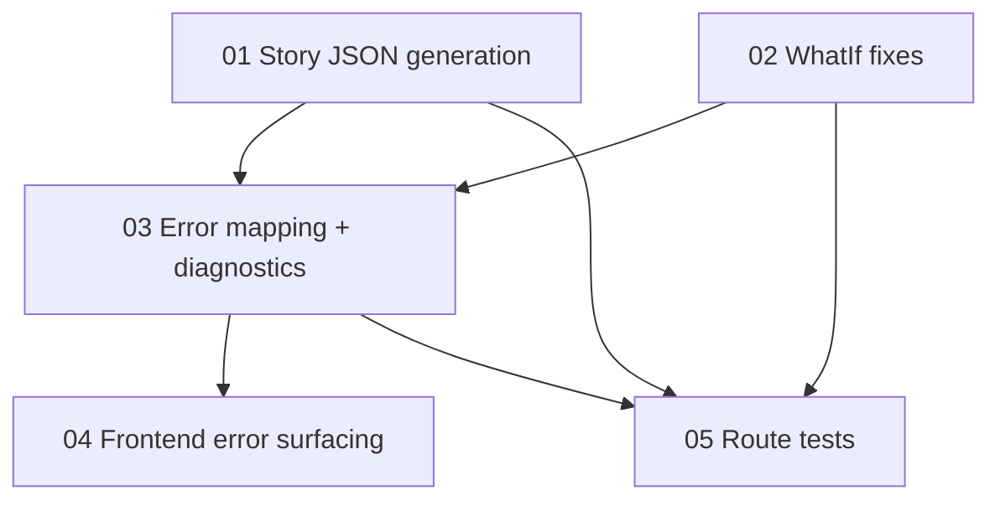

# Implementation Plan: Fix Learn WhatIf/Story 500s

**Created:** 2026-02-05  
**Status:** Completed  
**Total Features:** 5  
**Completed:** 5/5

## Progress Summary

| ID | Feature | Status | Dependencies | Priority |
|----|---------|--------|--------------|----------|
| 01 | Backend: Story prompt + scene JSON generation | ✅ Completed | - | High |
| 02 | Backend: WhatIf scenario + evaluation fixes | ✅ Completed | - | High |
| 03 | Backend: Learn error mapping + diagnostics | ✅ Completed | 01, 02 | Medium |
| 04 | Frontend: Friendly error surfacing for learn modes | ✅ Completed | 03 | Medium |
| 05 | Tests: Learn routes status mapping regression | ✅ Completed | 01, 02, 03 | Medium |

## Dependency Graph

## Status Legend

- ⬜ **Not Started**
- 🔄 **In Progress**
- ✅ **Completed**
- ⏸️ **Blocked**
- ⚠️ **Issues**

## Notes / Decisions

- Root causes identified in current code:
  - `/api/learn/story` calls `generateScript()` (returns `{ slides, error }`) but treats it like a string (calls `.trim()` / regex match) → runtime error → 500.
  - `/api/learn/whatif` services use `ai` without defining it and treat `extractJSON()` (string) as an object → always fails → 500.
- We’ll implement dedicated Gemini helpers returning parsed JSON objects for Story Prompt and Story Scene extraction.
- We’ll fix WhatIf generation/evaluation to:
  - use `getAIClient()`
  - request JSON output via `responseMimeType: 'application/json'`
  - parse and validate JSON consistently.
- Learn routes will map known AI error codes to HTTP status codes (503/429/502/400) instead of always 500.
