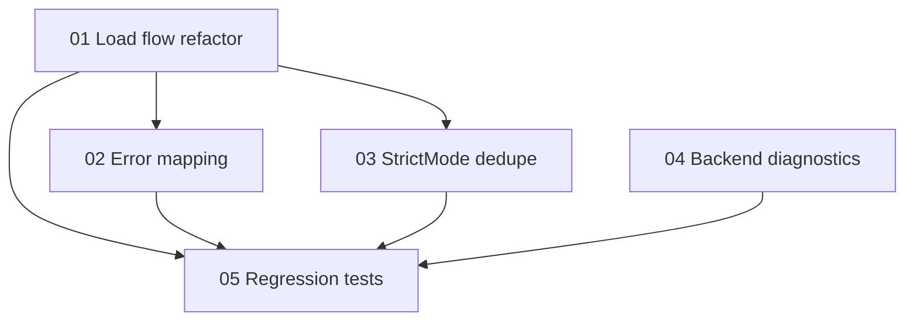

# Implementation Plan: Mystery Lab Dev Bug Fix

**Created:** 2026-02-06
**Status:** Completed
**Total Features:** 5
**Completed:** 5/5

## Progress Summary

| ID | Feature | Status | Dependencies | Priority |
|----|---------|--------|--------------|----------|
| 01 | Mystery load flow refactor (imagePrompt contract) | ✅ Completed | - | High |
| 02 | Mystery error mapping UX alignment | ✅ Completed | 01 | High |
| 03 | StrictMode dedupe + stale request guard | ✅ Completed | 01 | High |
| 04 | Backend API_NOT_AVAILABLE diagnostics | ✅ Completed | - | Medium |
| 05 | Regression tests (frontend + backend) | ✅ Completed | 01, 02, 03, 04 | High |

## Dependency Graph

## Status Legend

- ⬜ **Not Started** - Feature not yet begun
- 🔄 **In Progress** - Actively being worked on
- ✅ **Completed** - Feature finished and verified
- ⏸️ **Blocked** - Waiting on dependencies
- ⚠️ **Issues** - Requires attention

## Notes

- Scope intentionally excludes storage quota warning: `frontend/src/utils/topicStorage.js`.
- Keep backend API contract stable; fix frontend request payload and resilience behavior.
- Verification:
- `cd backend && npm test -- --run src/routes/__tests__/learn.mystery.test.js`
- `cd backend && npm test -- --run src/services/__tests__/mysteryGenerator.test.js`
- `cd frontend && npm test -- --run src/components/LearnModes/Mystery/__tests__/MysteryLab.test.jsx`
