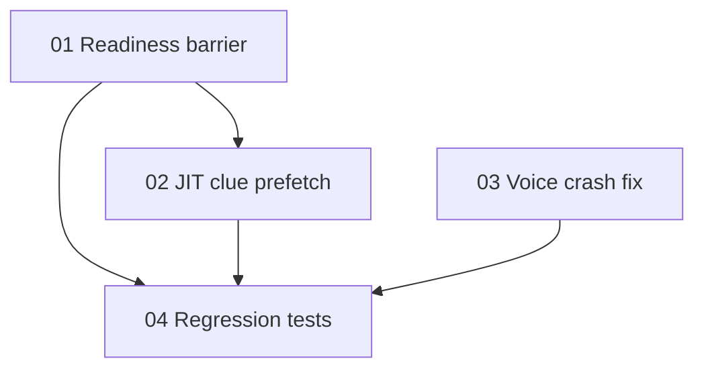

# Implementation Plan: Mystery Lab Readiness + JIT + Crash Fix

**Created:** 2026-02-06
**Status:** Completed
**Total Features:** 4
**Completed:** 4/4

## Progress Summary

| ID | Feature | Status | Dependencies | Priority |
|----|---------|--------|--------------|----------|
| 01 | Intro readiness barrier (image + intro TTS) | ✅ Completed | - | High |
| 02 | JIT clue narration prefetch | ✅ Completed | 01 | High |
| 03 | SolveVoiceText TDZ crash fix | ✅ Completed | - | High |
| 04 | Regression tests and verification | ✅ Completed | 01, 02, 03 | High |

## Dependency Graph

## Verification
- `cd frontend && npm test -- --run src/components/LearnModes/Mystery/__tests__/MysteryLab.test.jsx src/components/LearnModes/Mystery/__tests__/SolveVoiceText.test.jsx`
- `cd frontend && npx eslint src/components/LearnModes/Mystery/MysteryLab.jsx src/components/LearnModes/Mystery/SolveVoiceText.jsx src/components/LearnModes/Mystery/__tests__/MysteryLab.test.jsx src/components/LearnModes/Mystery/__tests__/SolveVoiceText.test.jsx`
- `cd frontend && npm run build`
