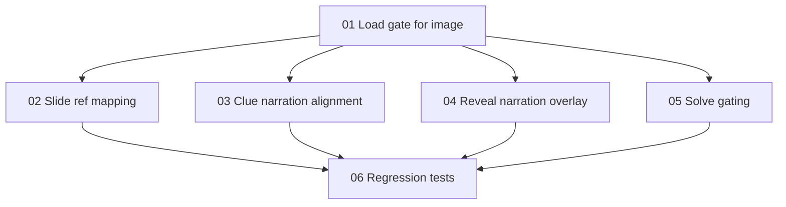

# Implementation Plan: Mystery Lab UX + Flow Bug Fixes

**Created:** 2026-02-06
**Status:** Completed
**Total Features:** 6
**Completed:** 6/6

## Progress Summary

| ID | Feature | Status | Dependencies | Priority |
|----|---------|--------|--------------|----------|
| 01 | Block intro until image fetch settles | ✅ Completed | - | High |
| 02 | Fix slide reference mapping for clue images | ✅ Completed | 01 | High |
| 03 | Align clue narration with on-screen text | ✅ Completed | 01 | High |
| 04 | Add reveal narration loading overlay | ✅ Completed | 01 | Medium |
| 05 | Require 3 solve tasks before reveal | ✅ Completed | 01 | High |
| 06 | Add regression tests for all fixes | ✅ Completed | 01, 02, 03, 04, 05 | High |

## Dependency Graph

## Notes
- Completion gate is explicitly: `mcq`, `evidence-board`, `fill-blank`.
- `voice-text` remains available but optional.
- Verification commands:
- `cd frontend && npm test -- --run src/components/LearnModes/Mystery/__tests__/MysteryLab.test.jsx`
- `cd frontend && npx eslint src/components/LearnModes/Mystery/MysteryLab.jsx src/components/LearnModes/Mystery/TheorySolver.jsx src/components/LearnModes/Mystery/SolutionReveal.jsx src/components/LearnModes/Mystery/SolveEvidenceBoard.jsx src/components/LearnModes/Mystery/SolveFillBlank.jsx src/components/LearnModes/Mystery/__tests__/MysteryLab.test.jsx`
