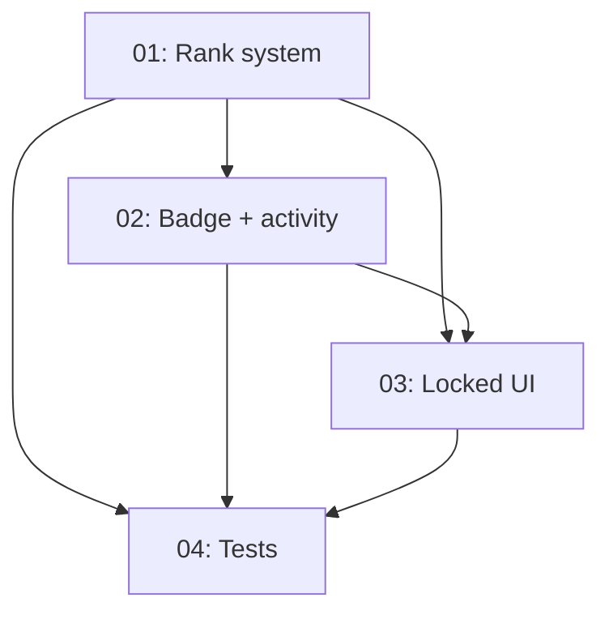

# Implementation Plan: One-Year Progress System (12 Ranks + 16 Badges)

**Created:** 2026-02-05  
**Status:** ✅ Completed  
**Total Features:** 4  
**Completed:** 4/4

## Progress Summary

| ID | Feature | Status | Dependencies | Priority |
|----|---------|--------|--------------|----------|
| 01 | Hybrid 12-rank system (logic + UI) | ✅ Completed | - | High |
| 02 | Badge expansion + activity tracking | ✅ Completed | 01 | High |
| 03 | Locked badges & levels UI in Progress | ✅ Completed | 01, 02 | Medium |
| 04 | Tests + verification | ✅ Completed | 01, 02, 03 | Medium |

## Dependency Graph

## Notes
- Rank system uses **hybrid gates** (topics + XP) to ensure learning modes count.
- Badges expanded to 16 total across firsts, streaks, modes, and mastery.
- Locked badges/levels should motivate without pushing constellation down.

## Status Legend
- ⬜ Not Started
- 🔄 In Progress
- ✅ Completed
- ⏸️ Blocked
- ⚠️ Issues
