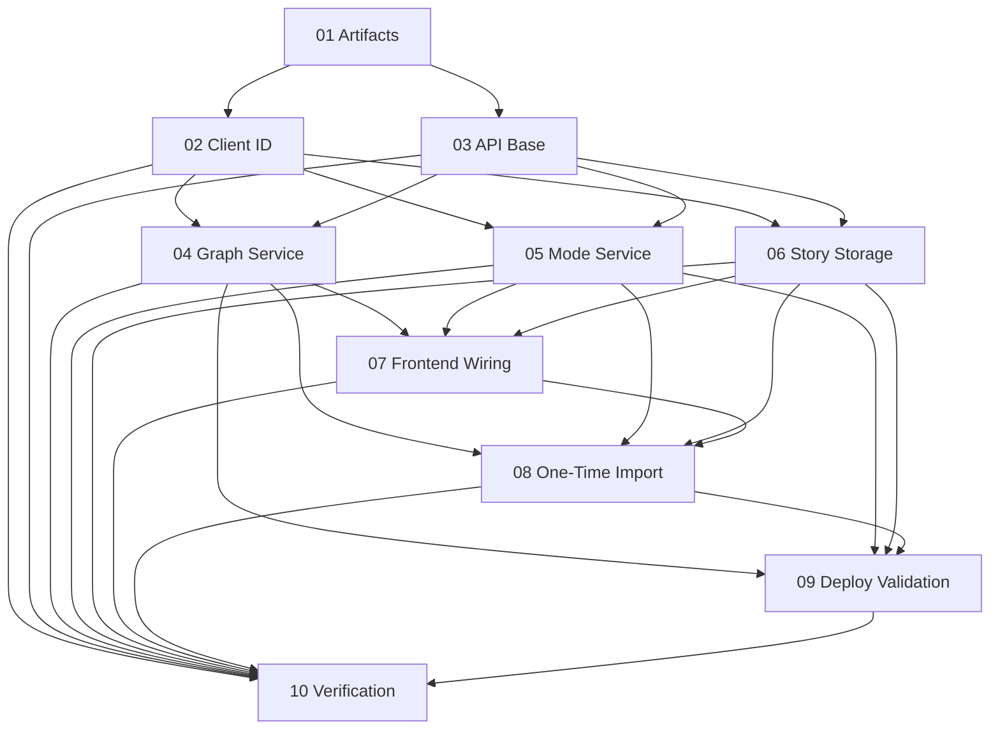

# Implementation Plan: Cloud Run Persistence Readiness

**Created:** 2026-02-07
**Status:** In Progress
**Total Features:** 10
**Completed:** 0/10

## Progress Summary

| ID | Feature | Status | Dependencies | Priority |
|----|---------|--------|--------------|----------|
| 01 | Planning Artifacts and Feature Breakdown | ✅ Completed | - | High |
| 02 | Unified Client Identity | ⬜ Not Started | 01 | High |
| 03 | Same-Origin API Base Helper | ⬜ Not Started | 01 | High |
| 04 | Graph Cloud Persistence Service + Routes | ⬜ Not Started | 02,03 | High |
| 05 | Mode Session Persistence Service + Routes | ⬜ Not Started | 02,03 | High |
| 06 | Story Cloud-First Storage Upgrade | ⬜ Not Started | 02,03 | High |
| 07 | Frontend Wiring: Graph Save/Load + Mode Session Save | ⬜ Not Started | 04,05,06 | High |
| 08 | One-Time Local Import API + Frontend Bootstrap | ⬜ Not Started | 04,05,06,07 | High |
| 09 | Cloud Run Deployment Script/Env Validation | ⬜ Not Started | 04,05,06,08 | Medium |
| 10 | Verification + Code Review Agent Runs | ⬜ Not Started | 02,03,04,05,06,07,08,09 | High |

## Dependency Graph

## Status Legend
- ⬜ Not Started
- 🔄 In Progress
- ✅ Completed
- ⏸️ Blocked
- ⚠️ Issues

## Notes
- Completed-mode persistence scope only (no in-progress resume).
- Preserve anonymous user behavior via stable client ID.
- Keep `livingWorldStore` untouched.
