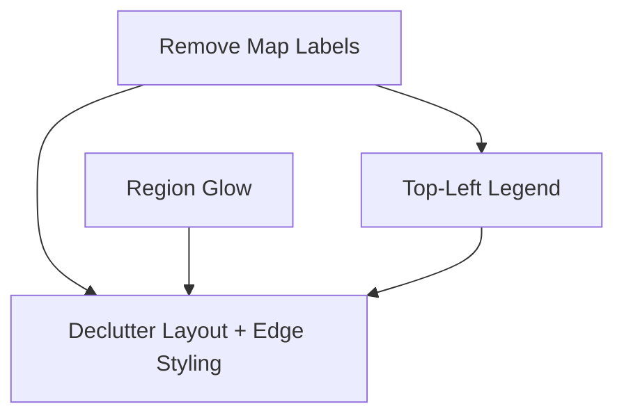

# Implementation Plan: Category Visualization

**Created:** 2026-02-05
**Status:** Completed
**Total Features:** 4
**Completed:** 4/4

## Progress Summary

| ID | Feature | Status | Dependencies | Priority |
|----|---------|--------|--------------|----------|
| 01 | Remove Map Category Labels | ✅ Completed | - | High |
| 02 | Region Glow Emphasis | ✅ Completed | - | Medium |
| 03 | Top-Left Category Legend | ✅ Completed | 01 | Medium |
| 04 | Declutter Layout + Edge Styling | ✅ Completed | 01,02,03 | High |

## Dependency Graph

## Status Legend

- ⬜ **Not Started** - Feature not yet begun
- 🔄 **In Progress** - Actively being worked on
- ✅ **Completed** - Feature finished and verified
- ⏸️ **Blocked** - Waiting on dependencies
- ⚠️ **Issues** - Requires attention
