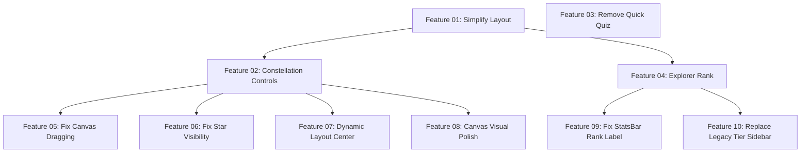

# Implementation Plan: Constellation-First UI Redesign

**Created:** 2026-02-04
**Status:** ✅ Completed
**Total Features:** 10
**Completed:** 10/10

## Vision

Transform the Progress tab from a list-based interface to a constellation-first experience. Remove all clutter (Due for Review, Quick Practice, Topics by Zone sections) and make the interactive star map the primary navigation interface.

## Progress Summary

| ID | Feature | Status | Dependencies | Priority | Complexity |
|----|---------|--------|--------------|----------|------------|
| 01 | Simplify ProgressTab Layout | ✅ Completed | - | High | Medium |
| 02 | Enhance Constellation Controls | ✅ Completed | 01 | High | Medium |
| 03 | Remove Quick Quiz Mode | ✅ Completed | - | High | Low |
| 04 | Replace Tree Level with Explorer Rank | ✅ Completed | 01 | High | Medium |
| 05 | Fix Canvas Dragging | ✅ Completed | 02 | High | Low |
| 06 | Fix Star Visibility and Labels | ✅ Completed | 02 | High | Medium |
| 07 | Dynamic Layout Center | ✅ Completed | 02 | Medium | Medium |
| 08 | Canvas Visual Polish | ✅ Completed | 02 | Medium | Low |
| 09 | Fix StatsBar Rank Label | ✅ Completed | 04 | High | Low |
| 10 | Replace Legacy Tier in Sidebar | ✅ Completed | 04 | High | Medium |

## Dependency Graph



**Critical Path:** 01 → 02 → (05, 06, 07, 08), 01 → 04 → (09, 10)
**Independent:** 03 (can be done anytime)
**Phase 1 (Foundation):** 01, 03, 04
**Phase 2 (Enhancement):** 02
**Phase 3 (Polish):** 05, 06, 07, 08, 09, 10

## Feature Descriptions

### Feature 01: Simplify ProgressTab Layout Structure
**File:** `frontend/src/components/ProgressTab/ProgressTab.jsx`

Remove all list-based sections and restructure to show only:
- Compact stats header at top
- Full-screen constellation view
- Topic action sheet overlay (modal)

**Removes:**
- ConstellationPreview component
- DueForReview section
- QuickPractice section
- TopicsByZone section
- Recommended Next section

**Key Result:** Constellation takes up 90% of screen space (up from 15%)

### Feature 02: Enhance Constellation Component Controls
**File:** `frontend/src/components/Constellation/Constellation.jsx`

Polish the full-screen constellation with:
- Neobrutalism-styled zoom controls (bold borders, hard shadows)
- Reset view button (⊙ symbol)
- Improved empty state message
- Interaction hints for first-time users (1-3 topics)

**Key Result:** Constellation is beautiful and easy to use

### Feature 03: Remove Quick Quiz from Topic Action Sheet
**Files:**
- `frontend/src/components/ProgressTab/TopicActionSheet.jsx`
- `frontend/src/components/ProgressTab/ProgressTab.jsx`

Remove Quick Quiz mode completely, leaving only 3 learning modes:
- Mystery Lab
- Wonder Lab
- Story Studio

Update grid from 2 columns to 3 columns.

**Key Result:** Simpler mode selection, cleaner UI

### Feature 04: Replace Tree Level with Explorer Rank
**Files:**
- `frontend/src/components/Dashboard/StatsBar.jsx`
- `frontend/src/components/ProgressTab/ProgressTab.jsx`

Replace legacy tree level (🌱 Seed, 🌿 Sprout) with explorer rank system (🔭 Stargazer, 🚀 Space Cadet, 🧭 Navigator, etc.). Remove `treeLevel` prop and calculate rank from `topicsLearned`.

**Key Result:** Space exploration theme throughout UI

### Feature 05: Fix Canvas Dragging
**File:** `frontend/src/components/Constellation/Constellation.jsx`

Switch from allowlist drag detection (only specific elements) to blocklist pattern (exclude interactive elements). Add cursor feedback (grab/grabbing).

**Key Result:** Canvas dragging works from anywhere on background

### Feature 06: Fix Star Visibility and Labels
**Files:**
- `frontend/src/components/Constellation/ConstellationStar.jsx`
- `frontend/src/components/Constellation/ConstellationEdge.jsx`

Increase star sizes, add glow to all brightness levels, add persistent topic labels below stars, and improve edge opacity.

**Key Result:** Stars and connections much more visible

### Feature 07: Dynamic Layout Center
**Files:**
- `frontend/src/components/Constellation/Constellation.jsx`
- `frontend/src/components/Constellation/useConstellationLayout.js`

Add ResizeObserver to measure container and pass dynamic center coordinates to layout algorithm.

**Key Result:** Constellation stays centered on resize and orientation change

### Feature 08: Canvas Visual Polish
**Files:**
- `frontend/src/components/Constellation/Constellation.jsx`
- `frontend/src/components/ProgressTab/ProgressTab.jsx`

Add gradient background, decorative starfield dots, and neobrutalism border to canvas wrapper.

**Key Result:** Immersive space exploration aesthetic

### Feature 09: Fix StatsBar Rank Label
**File:** `frontend/src/components/Dashboard/StatsBar.jsx`

Show abbreviated rank title in compact mode (first word only) instead of hiding it completely.

**Key Result:** Better context in compact stats header

### Feature 10: Replace Legacy Tier in Sidebar
**Files:**
- `frontend/src/components/TopicSidebar.jsx`
- `frontend/src/App.jsx`

Replace Living World tier system with Explorer Rank in sidebar. Show rank icon, title, and progress bar with indigo theme.

**Key Result:** Unified progression system across all UI

## Implementation Order

### Recommended Sequence

1. **Start with Feature 01** (Simplify Layout)
   - Foundation change that enables everything else
   - High impact, clears the UI immediately
   - Blockers: Features 02 and 04

2. **Then Feature 03** (Remove Quick Quiz)
   - Independent, quick win
   - Can be done in parallel with 01
   - No blockers

3. **Then Features 02 & 04 in parallel**
   - Feature 02: Polish constellation
   - Feature 04: Fix stats bar
   - Both depend on Feature 01 being complete

### Time Estimates

**Phase 1 (Foundation):**
- Feature 01: 1-2 hours (significant restructuring)
- Feature 03: 30 minutes (simple removal)
- Feature 04: 1 hour (integration + testing)

**Phase 2 (Enhancement):**
- Feature 02: 1 hour (enhancements + styling)

**Phase 3 (Polish - from clever-mapping-backus.md):**
- Feature 05: 30 minutes (drag detection fix)
- Feature 06: 1 hour (star visibility + labels)
- Feature 07: 45 minutes (dynamic center)
- Feature 08: 30 minutes (visual polish)
- Feature 09: 20 minutes (rank label fix)
- Feature 10: 45 minutes (sidebar tier replacement)

**Total:** 7-8 hours for complete implementation

## Success Metrics

### Before (Current UI)
- Time to see full knowledge graph: 3+ scrolls, tap "Explore" button
- Primary interaction: Scrolling through lists
- Topics visible: Only via lists
- Cognitive load: High (6+ sections, many choices)
- Screen space allocation: 15% constellation, 85% lists

### After (Goal)
- Time to see full knowledge graph: Immediate (loads in view)
- Primary interaction: Exploring constellation (pan, zoom, tap)
- Topics visible: All at once in spatial layout
- Cognitive load: Low (1 main interface, tap to dive deeper)
- Screen space allocation: 90% constellation, 10% header

## Verification Checklist

After all features complete, verify:

### Visual
- [ ] Constellation takes up full tab height (except thin header)
- [ ] No list sections visible (Due for Review, Quick Practice, Topics by Zone gone)
- [ ] Stats bar shows 4 items: Streak, XP, Topics, Explorer Rank
- [ ] No tree level icons (🌱🌿🌳) - replaced with astronomer icons (🔭🚀🧭)
- [ ] Explorer rank icon changes based on topic count
- [ ] Zoom controls have neobrutalism styling (bold borders, hard shadows)
- [ ] Topic action sheet has only 3 modes (Mystery, Wonder, Story)

### Interaction
- [ ] Drag to pan constellation
- [ ] Scroll/pinch to zoom
- [ ] Tap star opens action sheet
- [ ] Zoom +/- buttons work
- [ ] Reset view button returns to center
- [ ] All 3 practice modes launch correctly

### Responsive
- [ ] Works on mobile (375px)
- [ ] Works on tablet (768px)
- [ ] Works on desktop (1024px+)
- [ ] Stats header doesn't wrap awkwardly
- [ ] Zoom controls accessible on all screens

### Accessibility
- [ ] Keyboard navigation works
- [ ] Screen reader announces properly
- [ ] ARIA labels on all interactive elements
- [ ] Focus states visible

## Testing Strategy

### Per-Feature Testing
1. Implement feature
2. Run visual checks (see feature file)
3. Test on multiple screen sizes
4. Check for console errors
5. Mark feature as ✅ Completed

### Integration Testing
After all features complete:
1. Full user flow test
2. Cross-browser testing (Chrome, Safari, Firefox)
3. Mobile device testing (iOS, Android)
4. Accessibility audit
5. Performance check (< 300ms animations)

## Rollback Plan

If major issues discovered:

1. **Quick revert:** Restore removed components
   ```bash
   git revert <commit-hash>
   ```

2. **Partial revert:** Keep Features 03 & 04, restore Feature 01
   - Re-add list sections
   - Keep Quick Quiz removed
   - Keep Explorer Rank

3. **Files to restore:**
   - `DueForReview.jsx`
   - `QuickPractice.jsx`
   - `TopicsByZone.jsx`
   - ConstellationPreview component code

## Status Legend

- ⬜ **Not Started** - Feature not yet begun
- 🔄 **In Progress** - Actively being worked on
- ✅ **Completed** - Feature finished and verified
- ⏸️ **Blocked** - Waiting on dependencies
- ⚠️ **Issues** - Requires attention

## Notes

### Design Philosophy
**Constellation as Knowledge Map:**
- Spatial memory: Users remember "where" topics are in the map
- Exploration: Discovery through browsing, not searching lists
- Context: See relationships between topics visually
- Focus: One clear task → explore your knowledge

**Minimalist UI:**
- Remove everything that can be accessed through the constellation
- Stats header: Essential info only (progress metrics)
- Action sheet: Deep dive when needed
- Controls: Only zoom (pan via drag)

### Key Decisions

1. **Keep removed component files initially**
   - Don't delete DueForReview.jsx, QuickPractice.jsx, TopicsByZone.jsx yet
   - Just don't import/render them
   - Can restore if needed

2. **Full-screen always, no toggle**
   - Constellation is always "expanded"
   - No collapse/expand state
   - Simpler mental model

3. **Stats in header, rank in constellation**
   - StatsBar shows: Streak, XP, Topics, Explorer Rank
   - Compact and informative
   - Rank also visible in constellation UI

## Related Files

- **Original Plan:** `00-original-plan.md`
- **Feature Files (Phase 1-2):**
  - `01-simplify-progress-tab-layout.md`
  - `02-enhance-constellation-controls.md`
  - `03-remove-quick-quiz-mode.md`
  - `04-replace-tree-level-with-explorer-rank.md`
- **Feature Files (Phase 3 - Polish):**
  - `05-fix-canvas-dragging.md`
  - `06-fix-star-visibility.md`
  - `07-dynamic-layout-center.md`
  - `08-canvas-visual-polish.md`
  - `09-fix-statsbar-rank-label.md`
  - `10-replace-legacy-tier-sidebar.md`

## Next Steps

1. Review this overview for accuracy
2. Start with Feature 01 (foundation)
3. Test thoroughly after each feature
4. Update status in this file as you progress
5. Run full verification checklist when all complete

---

**Last Updated:** 2026-02-04
**Plan Status:** ✅ Completed (10/10 features)
**Implementation Notes:** Features 01-04 completed in initial phase. Features 05-10 completed as polish phase based on "Fix Constellation UI — 7 Issues" plan (clever-mapping-backus.md).
