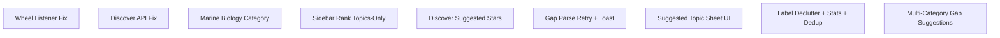

# Implementation Plan: Constellation Fixes (Discover, Marine Biology, Rank Bar, Wheel)

**Created:** 2026-02-05
**Status:** Completed
**Total Features:** 9
**Completed:** 9/9

## Progress Summary

| ID | Feature | Status | Dependencies | Priority |
|----|---------|--------|--------------|----------|
| 01 | Constellation Wheel Passive Listener Fix | ✅ Completed | - | High |
| 02 | Discover Button API Contract Fix | ✅ Completed | - | High |
| 03 | Marine Biology Category + Migration | ✅ Completed | - | Medium |
| 04 | Sidebar Rank Topics-Only | ✅ Completed | - | Medium |
| 05 | Discover Suggested Stars + Gap Edges | ✅ Completed | - | High |
| 06 | Gap JSON Retry + Discover Toast | ✅ Completed | - | High |
| 07 | Suggested Topic Sheet + Readability | ✅ Completed | 05 | High |
| 08 | Label Declutter + Stats + Dedup | ✅ Completed | 05, 07 | High |
| 09 | Multi-Category Gap Suggestions | ✅ Completed | 06 | High |

## Dependency Graph

## Status Legend

- ⬜ **Not Started** - Feature not yet begun
- 🔄 **In Progress** - Actively being worked on
- ✅ **Completed** - Feature finished and verified
- ⏸️ **Blocked** - Waiting on dependencies
- ⚠️ **Issues** - Requires attention

## Notes

- Features are independent and can be implemented in any order.
- Feature 06 includes JSON repair hardening (newline + missing comma) for gap parsing.
