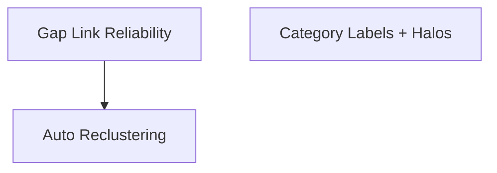

# Implementation Plan: Constellation Organization Fixes

**Created:** 2026-02-05
**Status:** Completed
**Total Features:** 3
**Completed:** 3/3

## Progress Summary

| ID | Feature | Status | Dependencies | Priority |
|----|---------|--------|--------------|----------|
| 01 | Gap Link Reliability | ✅ Completed | - | High |
| 02 | Auto Reclustering on New Topic | ✅ Completed | 01 | High |
| 03 | Category Labels + Halos | ✅ Completed | - | Medium |

## Dependency Graph

## Status Legend

- ⬜ **Not Started** - Feature not yet begun
- 🔄 **In Progress** - Actively being worked on
- ✅ **Completed** - Feature finished and verified
- ⏸️ **Blocked** - Waiting on dependencies
- ⚠️ **Issues** - Requires attention
