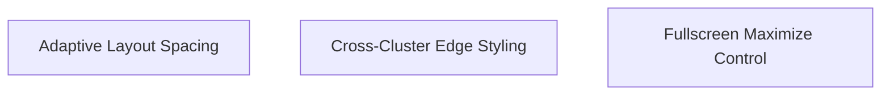

# Implementation Plan: Constellation Spacing + Fullscreen

**Created:** 2026-02-05
**Status:** Completed
**Total Features:** 3
**Completed:** 3/3

## Progress Summary

| ID | Feature | Status | Dependencies | Priority |
|----|---------|--------|--------------|----------|
| 01 | Adaptive Layout Spacing | ✅ Completed | - | High |
| 02 | Cross-Cluster Edge Styling | ✅ Completed | - | High |
| 03 | Fullscreen Maximize Control | ✅ Completed | - | Medium |

## Dependency Graph

## Status Legend

- ⬜ **Not Started** - Feature not yet begun
- 🔄 **In Progress** - Actively being worked on
- ✅ **Completed** - Feature finished and verified
- ⏸️ **Blocked** - Waiting on dependencies
- ⚠️ **Issues** - Requires attention

## Notes

- Cross-cluster edges should remain clickable while visually de-emphasized.
- Fullscreen should use the native Fullscreen API for best immersion.
