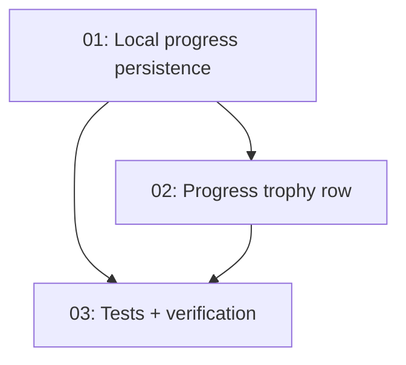

# Implementation Plan: Curious Mind Badge + Progress Trophy Row

**Created:** 2026-02-05  
**Status:** ✅ Completed  
**Total Features:** 3  
**Completed:** 3/3

## Progress Summary

| ID | Feature | Status | Dependencies | Priority |
|----|---------|--------|--------------|----------|
| 01 | Persist local user progress to disk (avoid repeated badge unlocks) | ✅ Completed | - | High |
| 02 | Show earned badges/trophies in Progress tab (compact row) | ✅ Completed | 01 | Medium |
| 03 | Tests + verification (backend + frontend) | ✅ Completed | 01, 02 | High |

## Dependency Graph

## Notes
- User report: "Curious Mind" achievement toast appears every time a new question is asked.
- Hypothesis: local progress fallback is in-memory and resets on backend restart/hot reload, causing "first question" badge to re-unlock.
- UX: achievements should be discoverable later, not only via toast -> add a compact trophy row in Progress.
- Tests run:
  - `cd backend && npm test -- --run userProgress.test.js`
  - `cd frontend && npm test -- --run ProgressTab.trophies.test.jsx`

## Status Legend
- ⬜ Not Started
- 🔄 In Progress
- ✅ Completed
- ⏸️ Blocked
- ⚠️ Issues
