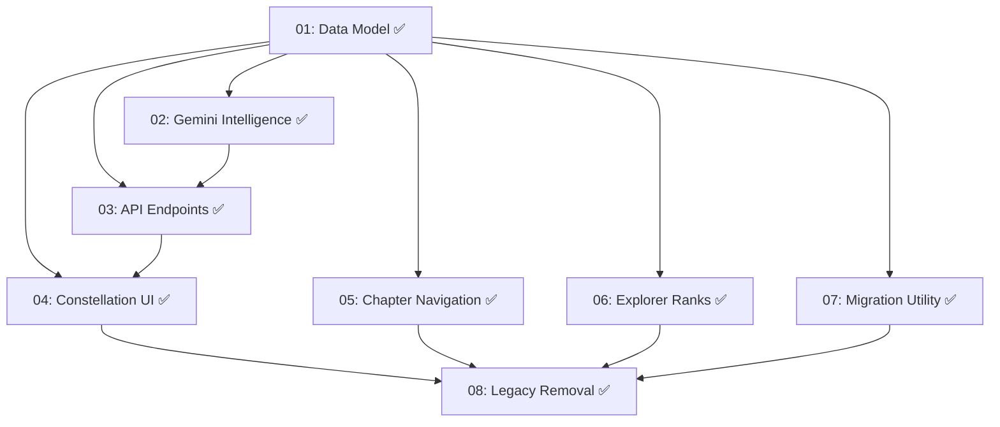

# Implementation Plan: Knowledge Constellation

**Created:** 2026-02-04
**Status:** Completed
**Total Features:** 8
**Completed:** 8/8

## Summary

Replace Living World and MagicalTree with a unified **Knowledge Constellation** - a Gemini-powered interactive graph that visualizes learning progress, topic relationships, and suggests new explorations.

**Key Intelligence Feature:** Gemini determines WHERE follow-up questions attach in the knowledge graph (child of current slide, sibling at topic level, new branch, or entirely new topic). This replaces the simple parentId logic with smart placement decisions.

## Progress Summary

| ID | Feature | Status | Dependencies | Priority |
|----|---------|--------|--------------|----------|
| 01 | Knowledge Graph Data Model | ✅ Completed | - | High |
| 02 | Gemini Graph Intelligence Service | ✅ Completed | 01 | High |
| 03 | Graph API Endpoints | ✅ Completed | 01, 02 | High |
| 04 | Knowledge Constellation UI | ✅ Completed | 01, 03 | High |
| 05 | Chapter-Based Slideshow Navigation | ✅ Completed | 01 | High |
| 06 | Explorer Rank Progression System | ✅ Completed | 01 | Medium |
| 07 | Data Migration Utility | ✅ Completed | 01 | High |
| 08 | Legacy Module Removal | ✅ Completed | 04, 05, 06, 07 | High |

## Dependency Graph

## Implementation Phases

### Phase 1: Foundation (Features 01-03) ✅
Backend data model, Gemini services, and API layer.

### Phase 2: Core UI (Features 04-06) ✅
Constellation visualization, chapter navigation integrated into SlideshowScreen, and Explorer Rank system.

### Phase 3: Migration & Cleanup (Features 07-08) ✅
Data migration complete. Legacy modules removed: LivingWorld, MagicalTree, TreeTab, FollowUpPanel, FollowUpDrawer, ProgressDots.

## Status Legend

- ⬜ **Not Started** - Feature not yet begun
- 🔄 **In Progress** - Actively being worked on
- ✅ **Completed** - Feature finished and verified
- ⏸️ **Blocked** - Waiting on dependencies
- ⚠️ **Issues** - Requires attention

## Files Overview

### Created (20+ files)
- `backend/src/models/knowledgeGraph.js` ✅
- `backend/src/services/geminiGraph.js` ✅
- `backend/src/routes/graph.js` ✅
- `frontend/src/types/knowledgeGraph.ts` ✅
- `frontend/src/hooks/useKnowledgeGraph.js` ✅
- `frontend/src/utils/graphMigration.js` ✅
- `frontend/src/utils/categoryUtils.js` ✅ (migrated from MagicalTree/treeUtils)
- `frontend/src/components/Constellation/*` ✅ (7 components + 5 test files)
- `frontend/src/components/ExplorerRank/*` ✅ (4 components + 3 test files)
- `frontend/src/components/Slideshow/*` ✅ (4 components + 4 test files)

### Deleted
- `frontend/src/components/LivingWorld/*` ✅ (entire directory - 22 files)
- `frontend/src/components/MagicalTree/*` ✅ (entire directory - 15 files)
- `frontend/src/components/TreeTab/*` ✅ (3 files)
- `frontend/src/hooks/useLivingWorld.js` ✅
- `frontend/src/components/ProgressTab/MiniWorldPreview.jsx` ✅
- `frontend/src/test-pages/TrophyBadgeTestPage.jsx` ✅
- `frontend/src/components/FollowUpPanel.jsx` ✅
- `frontend/src/components/FollowUpDrawer.jsx` ✅
- `frontend/src/components/ProgressDots.jsx` ✅
- `backend/src/routes/world.js` ❌ Kept (still used for XP/tier endpoints)

### Modified
- `frontend/src/App.jsx` ✅ (useKnowledgeGraph integrated, chapter nav props, dead world props removed, unused destructured values cleaned)
- `frontend/src/components/ProgressTab/ProgressTab.jsx` ✅ (Constellation replaces MiniWorldPreview)
- `frontend/src/hooks/useQuestionHandler.js` ✅ (onTopicCreated callback)
- `frontend/src/hooks/useSlideshowControl.js` ✅ (segment computation, chapter picker state, goToSegment aliased to goToSlide)
- `frontend/src/components/screens/SlideshowScreen.jsx` ✅ (ChapterProgressBar, ChapterPicker, SlideBreadcrumb; chapter picker state from hook props)
- `frontend/src/main.jsx` ✅ (test page removed)
- `backend/src/index.js` ✅ (graph routes registered)

## Verification Checklist

- [x] Fresh user sees empty constellation with Stargazer rank
- [x] First question creates a star with Gemini-discovered relationships
- [x] Follow-up questions show chapter segments in slideshow
- [x] Quiz completion updates star brightness
- [x] Multiple topics form constellations with visible edges
- [x] Gap suggestions appear as dim pulsing stars
- [x] Rank up triggers celebration animation
- [x] All legacy components fully removed (FollowUpPanel/Drawer/ProgressDots deleted)
- [x] No console errors or broken imports
- [x] Code review fixes: duplicate state bug, unused vars, label truncation, goToSegment dedup

## Test Results (2026-02-04)

- Frontend: 2,178 tests passing (56 test files)
- Backend: 65 tests passing (6 test files)
- Build: Successful (478 KB, 134 KB gzipped)
- Net code change: -14,000+ lines removed

## Notes

- Constellation replaces both World and Tree visualizations
- Explorer Ranks replace Tree Levels
- Chapter navigation (ChapterProgressBar/ChapterPicker/SlideBreadcrumb) replaces ProgressDots/FollowUpPanel/FollowUpDrawer
- Segment model: each parent slide + its children = one chapter segment
- useSlideshowControl computes segments as a presentation layer on top of existing 2D navigation
- `backend/src/routes/world.js` kept for now - XP/tier progression still uses it
- `categoryUtils.js` created to preserve `calculateTreeLevel`/`getZoneForCategory` utilities
- Living world stub variables remain in App.jsx (harmless no-ops, can be cleaned up in future refactoring)
- Code review post-cleanup: duplicate isChapterPickerOpen state fixed (hook state now passed as props), goToSegment aliased to goToSlide, label slice(0,30) removed (components handle truncation), unused destructured values removed from App.jsx
