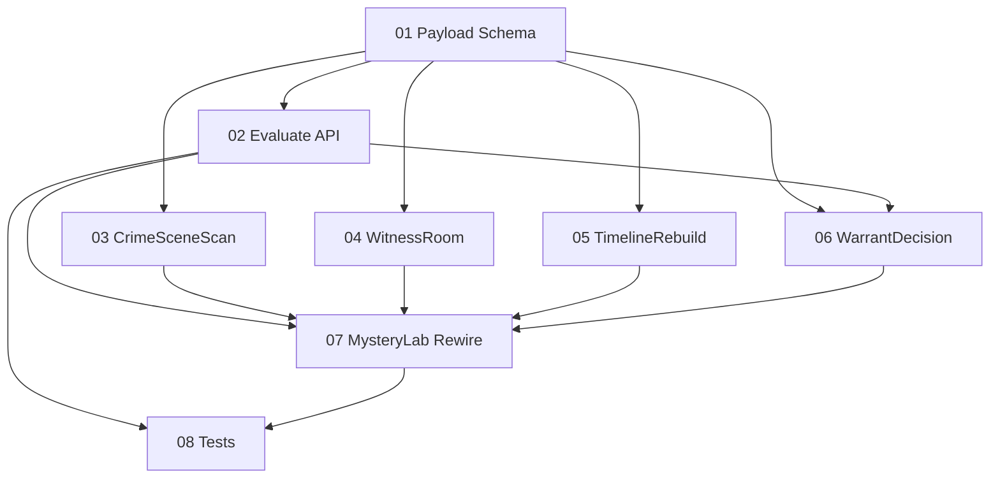

# Implementation Plan: Mystery Lab Crime Scene Ops

**Created:** 2026-02-06
**Status:** Completed
**Total Features:** 8
**Completed:** 8/8

## Progress Summary

| ID | Feature | Status | Dependencies | Priority | Complexity |
|----|---------|--------|--------------|----------|------------|
| 01 | Mystery Payload Schema + Generator Fallbacks | ✅ Completed | - | High | High |
| 02 | Mystery Evaluate API Crime Scene Ops Methods | ✅ Completed | 01 | High | High |
| 03 | CrimeSceneScan Component | ✅ Completed | 01 | High | Medium |
| 04 | WitnessRoom Component | ✅ Completed | 01 | High | Medium |
| 05 | TimelineRebuild Component | ✅ Completed | 01 | High | High |
| 06 | WarrantDecision Component | ✅ Completed | 01,02 | High | Medium |
| 07 | MysteryLab State Machine Rewire | ✅ Completed | 02,03,04,05,06 | High | High |
| 08 | Regression + New Tests | ✅ Completed | 02,07 | High | Medium |

## Dependency Graph

## Milestones

- **M1 Backend Contract Ready:** Features 01-02
- **M2 New Solve Modules Ready:** Features 03-06
- **M3 End-to-End Flow Ready:** Feature 07
- **M4 Verified:** Feature 08

## Notes

- Crime Scene Ops becomes default Mystery solve flow.
- Legacy payloads show recovery UI with retry.
- Existing intro/reveal narration hooks are retained.
