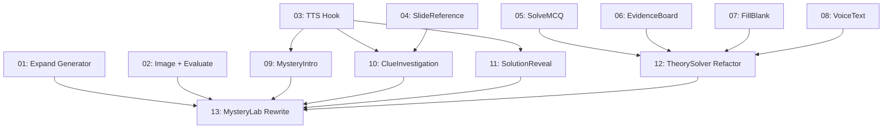

# Implementation Plan: Mystery Lab Redesign

**Created:** 2026-02-05
**Status:** ⬜ Not Started
**Total Features:** 13
**Completed:** 0/13

## Vision

Transform Mystery Lab from a static "wall of text" into a step-by-step guided detective story. Add TTS narration, manga-style scene images, inline slide references, and multiple kid-friendly solve methods (MCQ, evidence board, fill-in-blank, voice/text).

## Progress Summary

| ID | Feature | Status | Dependencies | Priority | Complexity |
|----|---------|--------|--------------|----------|------------|
| 01 | Expand Mystery Generator Prompt | ⬜ Not Started | - | High | Medium |
| 02 | Mystery Image Endpoint + Expand Evaluate | ⬜ Not Started | - | High | Medium |
| 03 | TTS Narration Hook | ⬜ Not Started | - | High | Medium |
| 04 | SlideReference Component | ⬜ Not Started | - | Medium | Low |
| 05 | SolveMCQ Component | ⬜ Not Started | - | Medium | Low |
| 06 | SolveEvidenceBoard Component | ⬜ Not Started | - | Medium | High |
| 07 | SolveFillBlank Component | ⬜ Not Started | - | Medium | Medium |
| 08 | SolveVoiceText Extract | ⬜ Not Started | - | Medium | Medium |
| 09 | MysteryIntro Component | ⬜ Not Started | 03 | High | Medium |
| 10 | ClueInvestigation Component | ⬜ Not Started | 03, 04 | High | High |
| 11 | SolutionReveal Component | ⬜ Not Started | 03 | High | Medium |
| 12 | TheorySolver Refactor | ⬜ Not Started | 05, 06, 07, 08 | High | Medium |
| 13 | MysteryLab Rewrite | ⬜ Not Started | 01, 02, 09, 10, 11, 12 | High | High |

## Dependency Graph



**Critical Path:** Tracks A-E → Track F (Feature 13)

## Parallel Tracks

### Track A: Backend (No dependencies)
Start immediately:
- Feature 01: Expand Mystery Generator Prompt
- Feature 02: Mystery Image Endpoint + Expand Evaluate

**Time Estimate:** 2-3 hours total

### Track B: Frontend Utilities (No dependencies)
Start immediately:
- Feature 03: TTS Narration Hook
- Feature 04: SlideReference Component

**Time Estimate:** 2-3 hours total

### Track C: Solve Methods (No dependencies)
Start immediately:
- Feature 05: SolveMCQ Component
- Feature 06: SolveEvidenceBoard Component
- Feature 07: SolveFillBlank Component
- Feature 08: SolveVoiceText Extract

**Time Estimate:** 4-5 hours total

### Track D: Frontend Scenes (Depends on Track B)
Start after Track B complete:
- Feature 09: MysteryIntro Component
- Feature 10: ClueInvestigation Component
- Feature 11: SolutionReveal Component

**Time Estimate:** 3-4 hours total

### Track E: Orchestrators (Depends on Track C)
Start after Track C complete:
- Feature 12: TheorySolver Refactor

**Time Estimate:** 1-2 hours

### Track F: Integration (Depends on all tracks)
Start after all other tracks complete:
- Feature 13: MysteryLab Rewrite

**Time Estimate:** 2-3 hours

**Total Estimated Time:** 14-20 hours

## Milestones

### Milestone 1: Foundation (Tracks A, B, C)
**Complete when:** Features 01-08 done
**Deliverable:** Backend APIs ready, all UI components isolated
**Enables:** Scene components and final integration

### Milestone 2: Scenes (Track D, E)
**Complete when:** Features 09-12 done
**Deliverable:** All scene components ready, solve methods orchestrated
**Enables:** Final integration

### Milestone 3: Integration (Track F)
**Complete when:** Feature 13 done
**Deliverable:** Full state machine working end-to-end
**Result:** Mystery Lab redesign complete

## Feature Descriptions

### Feature 01: Expand Mystery Generator Prompt
**File:** `backend/src/services/mysteryGenerator.js`

Expand Gemini prompt to generate additional fields: `theoryOptions`, `fillBlanks`, `evidenceConnections`, `revealNarration`, and `clue.narratorText` for each clue. Add validation fallbacks.

**Key Result:** Backend returns all data needed for multiple solve methods and narration

### Feature 02: Mystery Image Endpoint + Expand Evaluate
**Files:** `backend/src/routes/learn.js`

Add new endpoint `POST /api/learn/mystery/image` for manga-style scene generation. Expand evaluate endpoint with fast-path logic for MCQ, fill-blank, and evidence board.

**Key Result:** Frontend can generate images and evaluate all solve methods

### Feature 03: TTS Narration Hook
**File:** `frontend/src/components/LearnModes/Mystery/useMysteryNarration.js`

Custom hook for TTS playback with caching, prefetch strategy, and 3s rate limiting.

**Key Result:** Components can narrate text with simple API

### Feature 04: SlideReference Component
**File:** `frontend/src/components/LearnModes/Mystery/SlideReference.jsx`

Inline slide thumbnail with tap-to-enlarge modal. Maps 1-indexed slideRef to slides array.

**Key Result:** Clues can reference slides visually

### Feature 05: SolveMCQ Component
**File:** `frontend/src/components/LearnModes/Mystery/SolveMCQ.jsx`

Multiple-choice question UI with 4 option cards (A/B/C/D), selection state, and submit button.

**Key Result:** Kids can solve via MCQ

### Feature 06: SolveEvidenceBoard Component
**File:** `frontend/src/components/LearnModes/Mystery/SolveEvidenceBoard.jsx`

Interactive evidence board with clue cards and concept tags. Tap to connect clues to concepts.

**Key Result:** Kids can solve by connecting evidence

### Feature 07: SolveFillBlank Component
**File:** `frontend/src/components/LearnModes/Mystery/SolveFillBlank.jsx`

Fill-in-the-blank UI with tappable blank gaps and word bank chips.

**Key Result:** Kids can solve by filling blanks

### Feature 08: SolveVoiceText Extract
**File:** `frontend/src/components/LearnModes/Mystery/SolveVoiceText.jsx`

Extract existing voice/text solver from TheorySolver.jsx into standalone component.

**Key Result:** Kids can solve by speaking or typing

### Feature 09: MysteryIntro Component
**File:** `frontend/src/components/LearnModes/Mystery/MysteryIntro.jsx`

Intro screen with manga scene image, case title, setup text with TTS narration, and "Investigate" button.

**Key Result:** Story begins with immersive intro

### Feature 10: ClueInvestigation Component
**File:** `frontend/src/components/LearnModes/Mystery/ClueInvestigation.jsx`

Step-through clue investigation UI with progress dots, TTS narration, inline slide references, and collapsed previous clues.

**Key Result:** Focused clue-by-clue discovery

### Feature 11: SolutionReveal Component
**File:** `frontend/src/components/LearnModes/Mystery/SolutionReveal.jsx`

Reveal screen with scene image, TTS narration of reveal, solution explanation, XP/concepts earned, and continue button.

**Key Result:** Satisfying story conclusion

### Feature 12: TheorySolver Refactor
**File:** `frontend/src/components/LearnModes/Mystery/TheorySolver.jsx`

Refactor to method orchestrator with selector pills (MCQ, Evidence Board, Fill-Blank, Voice). Delegates to sub-components.

**Key Result:** Kids can choose preferred solve method

### Feature 13: MysteryLab Rewrite
**File:** `frontend/src/components/LearnModes/Mystery/MysteryLab.jsx`

Complete rewrite with 7-state machine: LOADING, INTRO, INVESTIGATE, SOLVE, EVALUATING, REVEAL, CELEBRATION. Orchestrates all new components.

**Key Result:** Full immersive detective experience

## Implementation Order

### Recommended Sequence

1. **Tracks A, B, C in parallel** (Features 01-08)
   - No dependencies between tracks
   - Foundation for everything else
   - Can assign to multiple developers/agents

2. **Tracks D, E in parallel** (Features 09-12)
   - Track D depends on Track B complete
   - Track E depends on Track C complete
   - Can run in parallel once dependencies met

3. **Track F** (Feature 13)
   - Depends on all previous features
   - Final integration
   - Single developer/agent for coherence

### Success Metrics

**Before (Current UI):**
- State: Single page, all content visible
- Flow: Scroll to read, scroll to solve
- Solve methods: 1 (voice/text only)
- Narration: None
- Images: None (just slide thumbnails)
- Cognitive load: High (everything at once)

**After (Goal):**
- State: 7-state machine, one step at a time
- Flow: Guided progression with TTS
- Solve methods: 4 (MCQ default, evidence board, fill-blank, voice/text)
- Narration: Every step auto-narrated
- Images: Manga-style scenes for intro/reveal
- Cognitive load: Low (focused attention)

## Verification Checklist

After all features complete, verify:

### Backend
- [ ] Mystery generator returns all new fields
- [ ] Image endpoint generates manga-style scenes
- [ ] Evaluate endpoint handles MCQ correctly
- [ ] Evaluate endpoint handles fill-blank correctly
- [ ] Evaluate endpoint handles evidence board correctly
- [ ] All endpoints have proper error handling

### Frontend Components
- [ ] TTS hook caches audio correctly
- [ ] TTS hook rate-limits requests (3s min)
- [ ] TTS hook prefetch works
- [ ] SlideReference shows thumbnail and enlarges
- [ ] SolveMCQ allows selection and submission
- [ ] EvidenceBoard connects clues to concepts
- [ ] FillBlank fills gaps from word bank
- [ ] VoiceText records and submits

### Frontend Scenes
- [ ] MysteryIntro shows scene image and narrates setup
- [ ] ClueInvestigation steps through clues with narration
- [ ] ClueInvestigation shows inline slide references
- [ ] SolutionReveal narrates reveal and shows XP
- [ ] TheorySolver switches between solve methods
- [ ] TheorySolver defaults to MCQ

### Integration
- [ ] MysteryLab loads mystery and image in parallel
- [ ] State transitions: LOADING → INTRO → INVESTIGATE → SOLVE → EVALUATING → REVEAL → CELEBRATION
- [ ] Progress dots show current clue
- [ ] Previous clues collapse
- [ ] Solve method persists during session
- [ ] TTS auto-plays at each step
- [ ] Images load correctly
- [ ] XP/concepts awarded correctly

### Responsive
- [ ] Works on mobile (375px)
- [ ] Works on tablet (768px)
- [ ] Works on desktop (1024px+)
- [ ] Images scale correctly
- [ ] Touch interactions work

### Accessibility
- [ ] Keyboard navigation works
- [ ] Screen reader announces properly
- [ ] ARIA labels on all interactive elements
- [ ] Focus states visible
- [ ] TTS can be paused/stopped

## Testing Strategy

### Per-Feature Testing
1. Implement feature
2. Run visual checks (see feature file)
3. Test on multiple screen sizes
4. Check for console errors
5. Mark feature as ✅ Completed

### Integration Testing
After all features complete:
1. Full user flow test (generate → intro → investigate → solve → reveal)
2. Test all 4 solve methods
3. Test TTS narration throughout
4. Cross-browser testing (Chrome, Safari, Firefox)
5. Mobile device testing (iOS, Android)
6. Accessibility audit
7. Performance check

## Rollback Plan

If major issues discovered:

1. **Quick revert:** Restore original MysteryLab.jsx
   ```bash
   git revert <commit-hash>
   ```

2. **Partial revert:** Keep new components, restore old orchestrator
   - Restore original MysteryLab.jsx and TheorySolver.jsx
   - Keep new components (usable in future iteration)

3. **Files to restore:**
   - `MysteryLab.jsx` (original version)
   - `TheorySolver.jsx` (original version)
   - `MysteryScene.jsx` (if removed)
   - `CluePanel.jsx` (if removed)

## Status Legend

- ⬜ **Not Started** - Feature not yet begun
- 🔄 **In Progress** - Actively being worked on
- ✅ **Completed** - Feature finished and verified
- ⏸️ **Blocked** - Waiting on dependencies
- ⚠️ **Issues** - Requires attention

## Notes

### Design Philosophy

**Narrator-Guided Experience:**
- Every step has TTS narration
- User advances at their own pace
- Story unfolds step-by-step
- Focused attention on current task

**Multiple Learning Styles:**
- Visual learners: Evidence board with connections
- Logical learners: MCQ and fill-blank
- Verbal learners: Voice/text explanation
- All paths equally valid

**Manga-Style Storytelling:**
- Scene images set the mood
- Inline slide references provide context
- Narrator guides the detective work
- Reveal provides satisfying conclusion

### Key Decisions

1. **MCQ as default solve method**
   - Lowest friction (tap to select)
   - Fastest for kids
   - Other methods available via selector

2. **TTS auto-plays at each step**
   - Immersive storytelling
   - Accessibility benefit
   - Can be paused/stopped

3. **Parallel tracks for implementation**
   - Faster development
   - Independent components
   - Integration as final step

4. **Manga-style scene images**
   - Visual storytelling
   - Kid-friendly aesthetic
   - Generated on-demand (not pre-made)

## Related Files

- **Original Plan:** `00-original-plan.md`
- **Feature Files (Track A - Backend):**
  - `01-expand-mystery-generator-prompt.md`
  - `02-mystery-image-endpoint-expand-evaluate.md`
- **Feature Files (Track B - Frontend Utilities):**
  - `03-tts-narration-hook.md`
  - `04-slide-reference-component.md`
- **Feature Files (Track C - Solve Methods):**
  - `05-solve-mcq-component.md`
  - `06-solve-evidence-board-component.md`
  - `07-solve-fill-blank-component.md`
  - `08-solve-voice-text-extract.md`
- **Feature Files (Track D - Frontend Scenes):**
  - `09-mystery-intro-component.md`
  - `10-clue-investigation-component.md`
  - `11-solution-reveal-component.md`
- **Feature Files (Track E - Orchestrators):**
  - `12-theory-solver-refactor.md`
- **Feature Files (Track F - Integration):**
  - `13-mystery-lab-rewrite.md`

## Next Steps

1. Review this overview for accuracy
2. Start with Tracks A, B, C in parallel (Features 01-08)
3. Test thoroughly after each feature
4. Update status in this file as you progress
5. Proceed to Tracks D, E once dependencies met
6. Final integration (Track F) when all features complete
7. Run full verification checklist

---

**Last Updated:** 2026-02-05
**Plan Status:** ⬜ Not Started (0/13 features)
