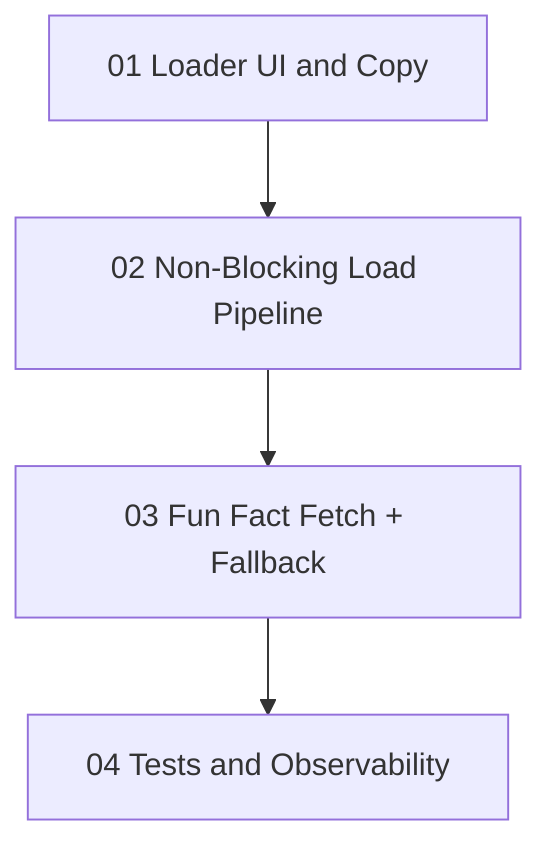

# Implementation Plan: Mystery Loader Hybrid Speed + Engagement

**Created:** 2026-02-06
**Status:** Completed
**Total Features:** 4
**Completed:** 4/4

## Progress Summary

| ID | Feature | Status | Dependencies | Priority |
|----|---------|--------|--------------|----------|
| 01 | Loader UI and Copy | ✅ Completed | - | High |
| 02 | Non-Blocking Load Pipeline | ✅ Completed | 01 | High |
| 03 | Fun Fact Fetch + Fallback | ✅ Completed | 02 | High |
| 04 | Tests and Observability | ✅ Completed | 03 | Medium |

## Dependency Graph

## Status Legend

- ⬜ **Not Started** - Feature not yet begun
- 🔄 **In Progress** - Actively being worked on
- ✅ **Completed** - Feature finished and verified
- ⏸️ **Blocked** - Waiting on dependencies
- ⚠️ **Issues** - Requires attention

## Notes

- Implemented `MysteryLoader.jsx` and level-tuned fallback fact data.
- Refactored Mystery load flow to enter `BRIEFING` before image/prefetch complete.
- Added delayed engagement fun-fact fetch with timeout + fallback rotation.
- Verified with `vitest` on `MysteryLab.test.jsx` (7/7 passing).
