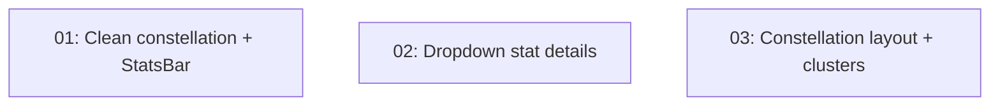

# Implementation Plan: Progress/Journey Page - Polish Round 2

**Created:** 2026-02-05
**Status:** Not Started
**Total Features:** 3
**Completed:** 0/3

## Progress Summary

| ID | Feature | Status | Dependencies | Priority |
|----|---------|--------|--------------|----------|
| 01 | Clean constellation + StatsBar labels | ⬜ Not Started | - | High |
| 02 | Dropdown stat details | ⬜ Not Started | - | High |
| 03 | Constellation layout + cluster cleanup | ⬜ Not Started | - | High |

## Dependency Graph

All 3 features are independent and can be implemented in parallel.

## Status Legend

- ⬜ **Not Started** - Feature not yet begun
- 🔄 **In Progress** - Actively being worked on
- ✅ **Completed** - Feature finished and verified
- ⏸️ **Blocked** - Waiting on dependencies
- ⚠️ **Issues** - Requires attention

## Notes

- Features grouped by file ownership to avoid merge conflicts
- All 3 can run as parallel coder agents
- Build verification required after all 3 complete
