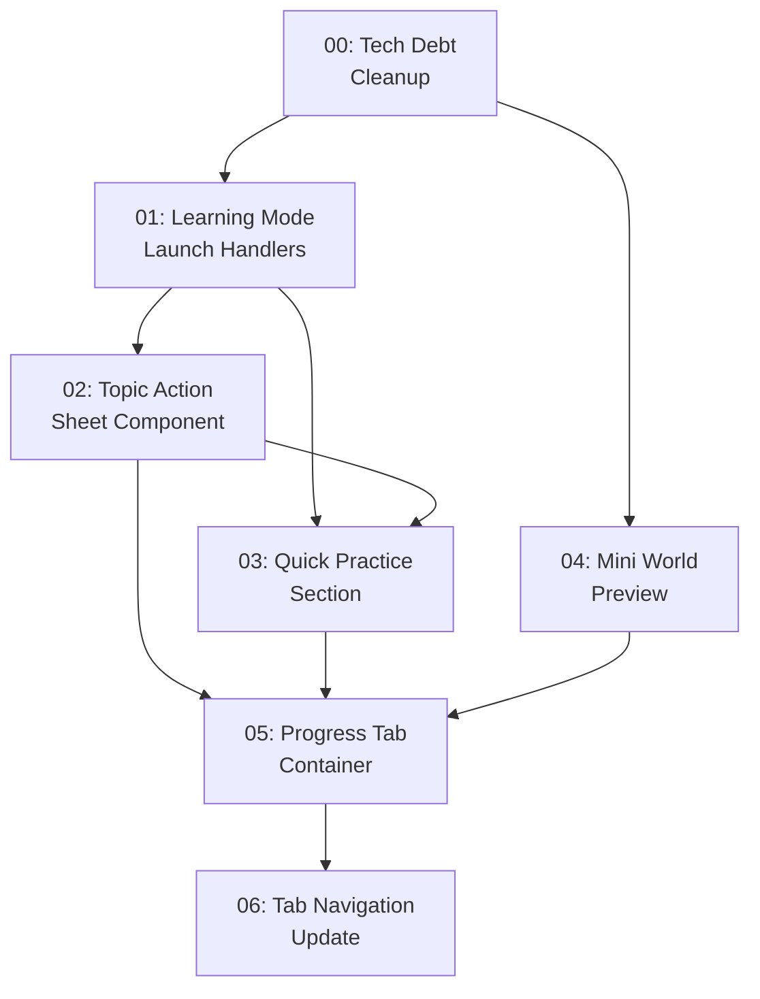

# Implementation Plan: Progress Tab Consolidation

**Created:** 2026-02-04
**Status:** Completed
**Total Features:** 7
**Completed:** 7/7

## Design Note

**Use `/ui-ux-pro-max` skill during frontend implementation for all UI components.**

## Progress Summary

| ID | Feature | Status | Dependencies | Priority |
|----|---------|--------|--------------|----------|
| 00 | Technical Debt Cleanup | ✅ Completed | - | **FIRST** |
| 01 | Learning Mode Launch Handlers | ✅ Completed | 00 | High |
| 02 | Topic Action Sheet Component | ✅ Completed | 01 | High |
| 03 | Quick Practice Section | ✅ Completed | 01, 02 | High |
| 04 | Mini World Preview Component | ✅ Completed | 00 | Medium |
| 05 | Progress Tab Container | ✅ Completed | 02, 03, 04 | High |
| 06 | Tab Navigation Update | ✅ Completed | 05 | High |

## Dependency Graph



## Parallel Tracks

### Phase 0: Tech Debt (Do First)
✅ Feature 00 (Tech Debt Cleanup) - **Completed**

### Track A: Core Handlers (After Phase 0)
✅ Feature 01 (Learning Mode Launch Handlers) - **Completed**

### Track B: World Integration (After Phase 0, parallel with Track A)
✅ Feature 04 (Mini World Preview) - **Completed**

### Track C: UI Components (After 01)
✅ Feature 02 → ✅ Feature 03 → ✅ Feature 05 → ✅ Feature 06

## Critical Path

```
00 → 01 → 02 → 03 → 05 → 06
```
Feature 04 can be done in parallel after 00 and merged at Feature 05.

## Status Legend

- ⬜ **Not Started** - Feature not yet begun
- 🔄 **In Progress** - Actively being worked on
- ✅ **Completed** - Feature finished and verified
- ⏸️ **Blocked** - Waiting on dependencies
- ⚠️ **Issues** - Requires attention

## Milestones

- [x] **M0: Clean Foundation** (Feature 00) - Tech debt cleaned up
- [x] **M1: Quick Win** (Feature 01) - Learning modes launchable from existing UI
- [x] **M2: Topic Actions** (Features 01-02) - Full action sheet working
- [x] **M3: Quick Practice** (Features 01-03) - Practice section complete
- [x] **M4: Full Progress Tab** (Features 01-06) - Complete consolidation

## Notes

- **Feature 00 must be completed first** - cleans up shared code
- Feature 01 and 04 can be implemented in parallel (after 00)
- Feature 05 integrates all previous components
- Feature 06 is the final step that removes World/Tree tabs
- **Use `/ui-ux-pro-max` skill** for all frontend component design

## Technical Debt Summary (Feature 00)

| Issue | Severity | Files Affected |
|-------|----------|----------------|
| Duplicated review status logic | HIGH | LivingWorldView, TreeTab |
| Oversized LivingWorldView (1048 lines) | HIGH | LivingWorldView.jsx |
| Duplicated constants | MEDIUM | Multiple files |
| Console.log in production | MEDIUM | usePocketScene, useReviewSession |
| Dead code | LOW | MagicalTree.jsx |

## Files Overview

| Feature | Files to Create | Files to Modify |
|---------|-----------------|-----------------|
| 00 | `reviewUtils.js`, `constants/world.js`, 5 extracted components | LivingWorldView, TreeTab, hooks |
| 01 | - | `App.jsx` |
| 02 | `TopicActionSheet.jsx` | - |
| 03 | `QuickPractice.jsx` | - |
| 04 | `MiniWorldPreview.jsx` | - |
| 05 | `ProgressTab.jsx` | - |
| 06 | - | `App.jsx`, Navigation components |
