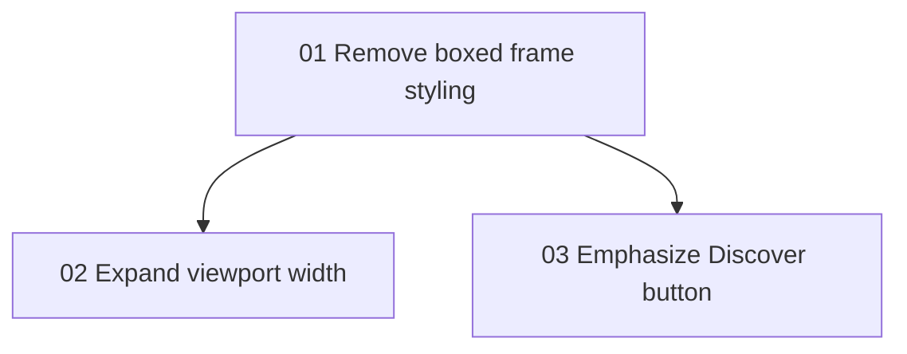

# Implementation Plan: Progress Tab Frame Polish

**Created:** 2026-02-06
**Status:** In Progress
**Total Features:** 3
**Completed:** 0/3

## Progress Summary

| ID | Feature | Status | Dependencies | Priority |
|----|---------|--------|--------------|----------|
| 01 | Remove boxed frame styling in status + map wrappers | 🔄 In Progress | - | High |
| 02 | Expand constellation viewport width on Progress tab | ⬜ Not Started | 01 | High |
| 03 | Increase Discover button visual prominence | ⬜ Not Started | 01 | Medium |

## Dependency Graph

## Status Legend

- ⬜ Not Started
- 🔄 In Progress
- ✅ Completed
- ⏸️ Blocked
- ⚠️ Issues
