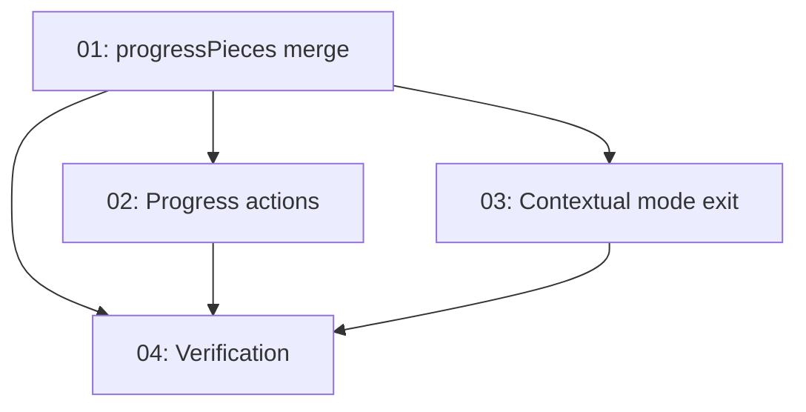

# Implementation Plan: Progress Tab Topic Visibility + Contextual Mode Exit

**Created:** 2026-02-04  
**Status:** ✅ Completed  
**Total Features:** 4  
**Completed:** 4/4

## Progress Summary

| ID | Feature | Status | Dependencies | Priority |
|----|---------|--------|--------------|----------|
| 01 | Build `progressPieces` (merge local topics + world metadata) | ✅ Completed | - | High |
| 02 | Fix Progress actions (Review Slideshow + Quick Quiz wiring) | ✅ Completed | 01 | High |
| 03 | Contextual exit for learning modes (Mystery/Wonder/Story) | ✅ Completed | 01 | High |
| 04 | Verification (tests/lint/build) + doc/status updates | ✅ Completed | 01, 02, 03 | Medium |

## Dependency Graph

## Notes
- This plan is stored under `plans/` (repo convention) instead of `plan/`.
- Goal is **topic visibility** in Progress immediately after watching a slideshow, even if `/api/world` has zero pieces.
- Verification: `npm test -- --run`, `npm run build`, `npm run lint` all pass in `frontend/` (lint has warnings).

## Status Legend
- ⬜ Not Started
- 🔄 In Progress
- ✅ Completed
- ⏸️ Blocked
- ⚠️ Issues
