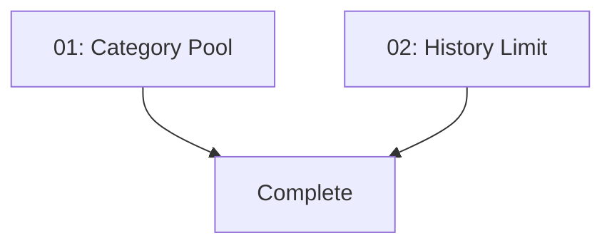

# Implementation Plan: Make "Surprise Me" Topics Truly Random

**Created:** 2026-02-04
**Status:** ✅ Completed
**Total Features:** 2
**Completed:** 2/2

## Progress Summary

| ID | Feature | Status | Dependencies | Priority |
|----|---------|--------|--------------|----------|
| 01 | Expanded Category Pool with Random Selection | ✅ Completed | - | High |
| 02 | Increase Topic History Limit | ✅ Completed | - | Medium |

## Dependency Graph

No dependencies between features - can be implemented in parallel.

## Status Legend

- ⬜ **Not Started** - Feature not yet begun
- 🔄 **In Progress** - Actively being worked on
- ✅ **Completed** - Feature finished and verified
- ⏸️ **Blocked** - Waiting on dependencies
- ⚠️ **Issues** - Requires attention

## Notes

- Root cause: LLM bias toward popular training examples + limited category list
- Solution: Constrain randomness at selection layer, not prompt layer
- Both features can be implemented in parallel
