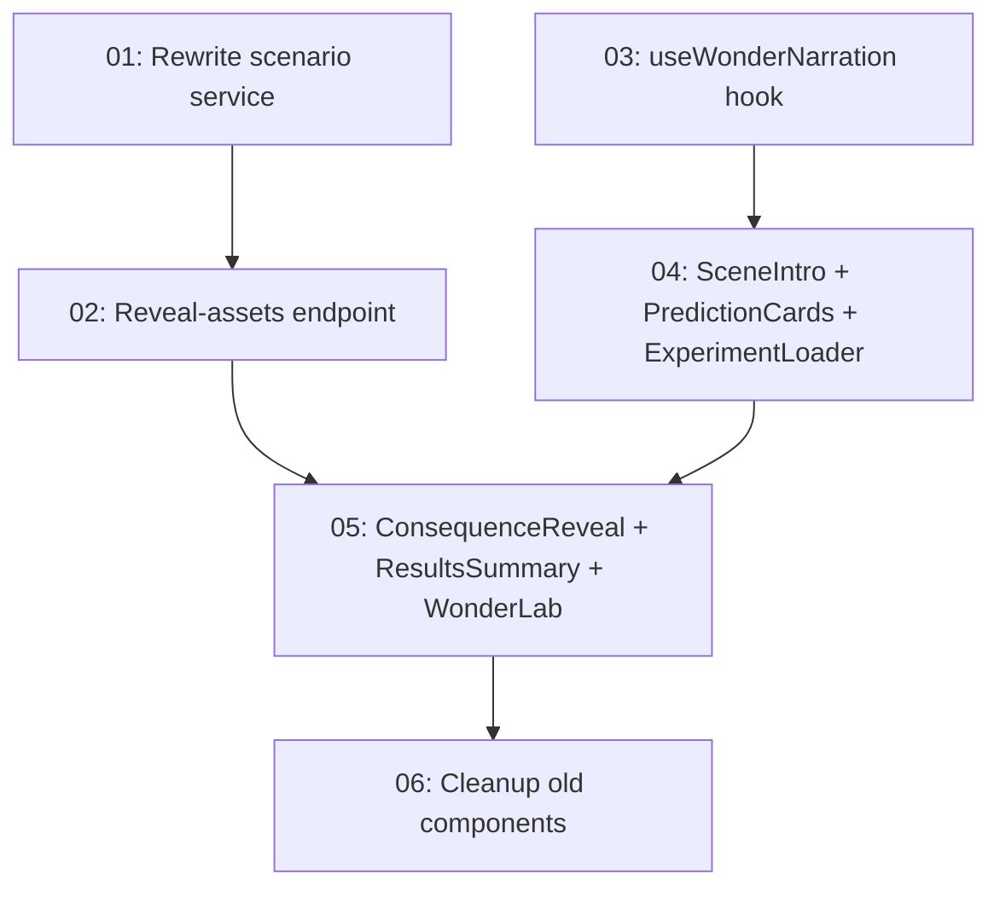

# Implementation Plan: Wonder Lab Redesign - Visual What-If Simulator

**Created:** 2026-02-06
**Status:** Not Started
**Total Features:** 6
**Completed:** 0/6

## Progress Summary

| ID | Feature | Status | Dependencies | Priority |
|----|---------|--------|--------------|----------|
| 01 | Rewrite generateWhatIfScenario + remove evaluate | ⬜ Not Started | - | High |
| 02 | Add reveal-assets endpoint + update whatif route | ⬜ Not Started | 01 | High |
| 03 | Create useWonderNarration hook | ⬜ Not Started | - | High |
| 04 | Create SceneIntro, PredictionCards, ExperimentLoader | ⬜ Not Started | 03 | High |
| 05 | Create ConsequenceReveal, ResultsSummary, rewrite WonderLab | ⬜ Not Started | 02, 04 | High |
| 06 | Cleanup: delete old components, update imports | ⬜ Not Started | 05 | Medium |

## Dependency Graph

## Parallel Tracks

### Track A: Backend (Features 01-02)
⬜ Feature 01 → ⬜ Feature 02

### Track B: Frontend Infra (Features 03-04)
⬜ Feature 03 → ⬜ Feature 04

**Note:** Tracks merge at Feature 05 (WonderLab orchestrator)

## Milestones

- [ ] **M1: Backend Ready** (Features 01-02)
- [ ] **M2: Frontend Infra** (Features 03-04)
- [ ] **M3: Full Integration** (Feature 05)
- [ ] **M4: Cleanup** (Feature 06)

## Status Legend

- ⬜ **Not Started** - Feature not yet begun
- 🔄 **In Progress** - Actively being worked on
- ✅ **Completed** - Feature finished and verified
- ⏸️ **Blocked** - Waiting on dependencies
- ⚠️ **Issues** - Requires attention

## Notes

- Tracks A and B can be implemented in parallel
- Feature 05 is the integration point where both tracks merge
- XP calculation is deterministic: 2/2=50, 1/2=25, 0/2=10
